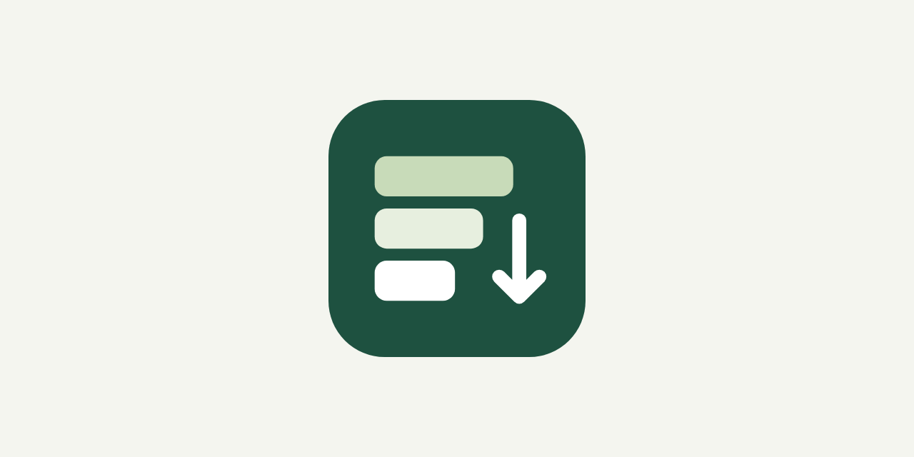
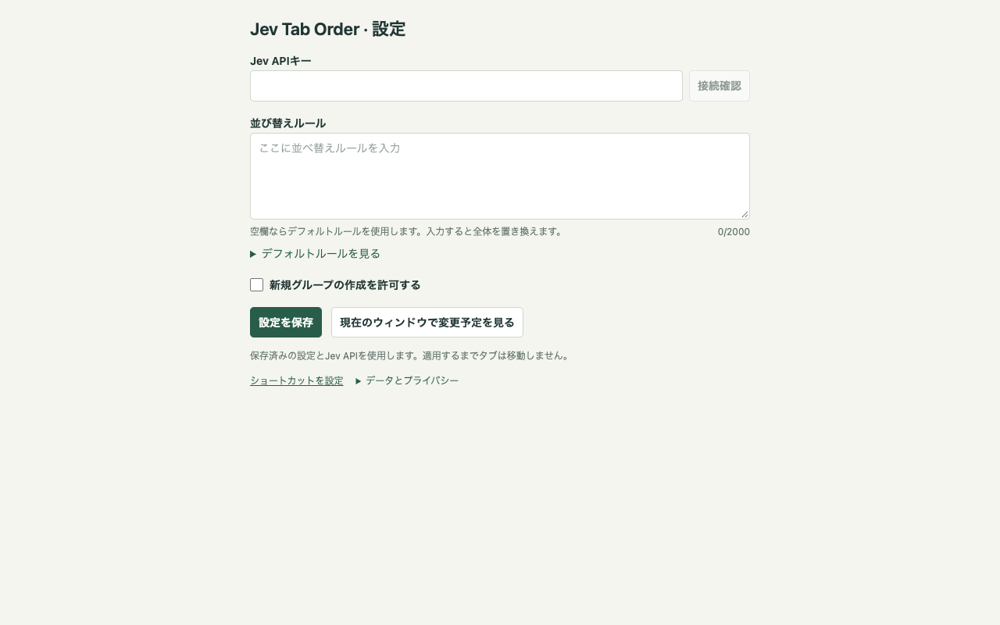

<div align="center">
  

# Jev Tab Order

[English](README.md) | [日本語](README.ja.md)

[](https://chromewebstore.google.com/detail/jev-tab-order/afbcjklgfmfokamphkgclkocfhgablka)
[](https://chromewebstore.google.com/detail/jev-tab-order/afbcjklgfmfokamphkgclkocfhgablka)
[](https://chromewebstore.google.com/detail/jev-tab-order/afbcjklgfmfokamphkgclkocfhgablka)
[](https://github.com/proshunsuke/jev-tab-order)
[](https://developer.chrome.com/docs/extensions/mv3/)
[](https://github.com/proshunsuke/jev-tab-order)

<a href="https://chromewebstore.google.com/detail/jev-tab-order/afbcjklgfmfokamphkgclkocfhgablka">
  
</a>

</div>

[Jev](https://typesafe.ai/)を利用し、現在のウィンドウのタブとグループを意味や指定した並べ替えルールに沿って整理するChrome拡張機能です。固定タブと既存グループの所属を維持します。

**Jev APIへの呼び出し1回で、ウィンドウ全体を整理。** タブ数にかかわらず、グループ分けと並び順をまとめて判断します。

## 使い始める

1. [Chrome Web Store](https://chromewebstore.google.com/detail/jev-tab-order/afbcjklgfmfokamphkgclkocfhgablka)から拡張機能をインストールします。
2. 拡張機能の設定を開き、TypeSafe JevのAPIキーを保存します。
3. 整理したいウィンドウでツールバーのアイコンをクリックします。ポップアップは開かず、アイコンに実行中は「…」、完了時は「✓」を表示し、完了から3秒後にバッジが消えます。ページの右クリックメニューや設定済みショートカットからも実行できます。

[対応言語](locales/)を参照してください。

ソースコードから導入する場合は、[手動インストール](#手動インストール)を参照してください。

### 設定

- **Jev APIキー**：この端末だけに保存します。API利用料が発生する場合があります。整理・プレビュー1回につきJevへのリクエストは最大1回です。元に戻す操作では送信しません。
- **並べ替えルール**：空欄なら既定ルールを使用します。入力すると既定ルール全体を置き換えます。例：「公式ドキュメントを先に、その後に解説記事。グループは開発、調査、個人の順。新しいグループは作らない。」
- **新規グループを許可**：この設定とルールの両方で許可され、関連する未所属タブが複数あり、命名用のChrome内蔵AIが利用できる場合に作成します。初回ダウンロードが必要な場合は設定画面の準備ボタンを押してください。



## 仕組み

拡張機能がウィンドウのタブ情報を集め、Jevに判断を依頼し、その回答から配置を組み立ててChromeに反映します。

1. **情報を集める — 拡張機能：** タブのタイトル、URL、現在の位置、グループへの所属を取得し、ルールとグループ名を合わせて準備します。固定タブはJevへの入力から除外し、ページ本文は読みません。URLの認証情報・クエリ・フラグメントは送信前に除去します。
2. **意味を判断する — Jev：** 「未所属タブをどの既存グループに追加するか」「どのタブやグループを隣接させるか」「ルール上、どれを前方・後方に配置するか」「新規グループ作成をルールが許可しているか」を、**1回のAPI呼び出しでまとめて判定**します。選択肢にはドメインやグループ名も添えます。回答は選択結果や優先度の数値で返り、選択確率と確信度も含まれます。
3. **配置を組み立てる — 拡張機能：** 採用した選択結果から未所属タブの追加先を決め、関連する項目を隣接するまとまりにします。その内部とまとまり同士を、Jevの優先度が小さい順に並べます。採用基準を下回る回答は使わず、同順位なら元の順序を維持し、有効な優先度がない項目はそのソート段階での位置を保ちます。この計算は端末内で行い、Jevを追加で呼び出しません。
4. **新規グループに名前を付ける — 有効な場合のみChromeのローカルAI：** 設定とJevの判断の両方が許可していれば、関連する未所属タブから新規グループを作れます。名前はタブのタイトルをもとにChrome内蔵AIが生成します。命名できなければ、新規グループを作らず隣接した状態にします。
5. **検証して反映する — 拡張機能：** タブの欠落や重複がなく、固定タブと既存グループの所属を維持できる計画かを確認し、Chrome APIでタブとグループを移動します。プレビューでは適用前で止まり、元に戻す操作ではJevを呼ばずに保存済みの配置を復元します。

たとえば、Jevが未所属タブの追加先として「GitHub」を選び、その回答が採用基準を満たした場合、拡張機能が既存のGitHubグループへタブを追加します。意味の判断をJevが担当し、ブラウザ上の操作を拡張機能が担当します。

### Jevに送るリクエストの内容

公式の `@typesafe-ai/sdk` を使い、`POST https://api.typesafe.ai/v1/systemone` に、`model: "jev-latest"` を指定してJSONを送ります。本文は共通の判断材料（`state`）と複数の質問（`questions`）で構成します。**API呼び出しは1回ですが、その中に複数の質問をまとめて入れています。**

- **`state` — 判断材料：** 適用するルール、WebタブのID・タイトル・加工済みURL・グループへの所属、既存グループの名前と所属タブのID、グループと未所属タブの現在の並びを渡します。タブの詳細情報は各質問で共有します。
- **`questions` — 判定してほしいこと：** 各質問に、`type`（ChoiceかScore）、`instructions`（ルールに従って何を判断するか）、`criteria`（選択肢または順序付きの評価段階）を指定します。

| 判定内容                                       | 種類                   | 求める回答                                                                                                        |
| ---------------------------------------------- | ---------------------- | ----------------------------------------------------------------------------------------------------------------- |
| 各未所属タブの追加先                           | **Choice**（`choice`） | 名前を添えた既存グループのID、または未所属のままにする `none`                                                     |
| 隣接させるタブ                                 | **Choice**（`choice`） | ドメインを添えた前方の候補タブのID、または該当なしの `self`。候補は同じ既存グループ内、または未所属タブ同士に限定 |
| 隣接させるグループ・未所属タブ                 | **Choice**（`choice`） | グループ名やドメインを添えた前方の候補のID、または別々にする `self`                                               |
| 各タブ、およびグループ・未所属タブの配置優先度 | **Score**（`score`）   | 「最も前・前・中間／順序指定なし・後・最も後」の5段階によるスコア                                                 |
| 新規グループ作成の可否（設定で有効な場合）     | **Choice**（`choice`） | ルール上、作成してよいかを `yes` / `no` で回答                                                                    |

Choiceでは選んだIDが `choice` に返り、拡張機能がタブ同士の関連付けや追加先の決定に使います。Scoreでは **0〜4の数値**（小数を含む）が返り、これをソートの優先度として使います。最終的なタブの位置番号ではありません。どちらも `probabilities`（各選択肢・段階の確率）と `confidence`（確信度）が付き、拡張機能が採用前に確認します。Scoreには段階番号と説明を対応させる `legend` も含まれます。

### 最小限のリクエスト・レスポンス例

固定されていないタブが2つだけある例です。タブ `1`（GitHub）は既存グループ `7`（GitHub）に所属し、その後ろに未所属のタブ `2`（GitHub Docs）があります。カスタムルールは「GitHubのタブをGitHubグループに追加します。ドキュメントを先に配置します。」、新規グループ作成は無効です。以下は、この入力で `buildPlan` と公式SDKを実行して取得したリクエスト本文のJSON全体をもとにしています。実際に生成される6問とその指示をすべて含み、フィールドや質問を省略していません。

`state.blocks` は、ウィンドウ全体での移動単位を現在の順序で並べたものです。既存グループは全体で1ブロック、未所属タブは1タブで1ブロックです。`key` は識別子、`title` はグループ名（未所属なら空文字）、`tabIds` は `state.tabs` の詳細情報を参照するIDです。Jevはこれを使い、グループ全体と未所属タブの順序・隣接関係を判断します。

例のルール、`instructions`、`criteria`、`legend`の文は、読みやすさのためREADMEの言語に合わせて翻訳しています。実装の固定指示・評価基準・既定ルールは英語で、この例を取得した際のカスタムルールも英語です。ユーザーが入力したカスタムルールは翻訳せず、そのまま送信します。JSONの構造、キー、ID、URL、数値は変更していません。

**リクエスト本文：**

```json
{
  "state": {
    "rules": "GitHubのタブをGitHubグループに追加します。ドキュメントを先に配置します。",
    "tabs": [
      {
        "id": "1",
        "title": "GitHub",
        "url": "https://github.com/",
        "groupId": 7
      },
      {
        "id": "2",
        "title": "GitHub Docs",
        "url": "https://docs.github.com/",
        "groupId": -1
      }
    ],
    "groups": [
      {
        "key": "group_7",
        "title": "GitHub",
        "tabIds": ["1"]
      }
    ],
    "blocks": [
      {
        "key": "group_7",
        "title": "GitHub",
        "tabIds": ["1"]
      },
      {
        "key": "topic_2",
        "title": "",
        "tabIds": ["2"]
      }
    ]
  },
  "questions": {
    "rank_tab_1": {
      "type": "score",
      "instructions": "state.rulesに従い、タブ1（ドメイン: github.com）のグループ内での配置優先度を評価してください。前に配置するほど低い点数にしてください。順序の指定がなければ中間の段階を使ってください。",
      "criteria": [
        "ルール上、最も前に配置する優先度",
        "ルール上、前に配置する優先度",
        "ルール上、中間の優先度、または特に順序の指定なし",
        "ルール上、後ろに配置する優先度",
        "ルール上、最も後ろに配置する優先度"
      ]
    },
    "membership_2": {
      "type": "choice",
      "instructions": "state.rulesに従い、未所属タブ2（ドメイン: docs.github.com）の追加先となる既存グループを選んでください。該当しなければnoneを選んでください。",
      "criteria": {
        "none": "未所属のままにする",
        "group_7": "グループ名: \"GitHub\""
      }
    },
    "rank_tab_2": {
      "type": "score",
      "instructions": "state.rulesに従い、タブ2（ドメイン: docs.github.com）のグループ内での配置優先度を評価してください。前に配置するほど低い点数にしてください。順序の指定がなければ中間の段階を使ってください。",
      "criteria": [
        "ルール上、最も前に配置する優先度",
        "ルール上、前に配置する優先度",
        "ルール上、中間の優先度、または特に順序の指定なし",
        "ルール上、後ろに配置する優先度",
        "ルール上、最も後ろに配置する優先度"
      ]
    },
    "rank_block_group_7": {
      "type": "score",
      "instructions": "state.rulesに従い、state.blocks内でのブロックgroup_7（グループ名: \"GitHub\"）の配置優先度を評価してください。前に配置するほど低い点数にしてください。順序の指定がなければ中間の段階を使ってください。",
      "criteria": [
        "ルール上、最も前に配置する優先度",
        "ルール上、前に配置する優先度",
        "ルール上、中間の優先度、または特に順序の指定なし",
        "ルール上、後ろに配置する優先度",
        "ルール上、最も後ろに配置する優先度"
      ]
    },
    "rank_block_topic_2": {
      "type": "score",
      "instructions": "state.rulesに従い、state.blocks内でのブロックtopic_2（ドメイン: docs.github.com）の配置優先度を評価してください。前に配置するほど低い点数にしてください。順序の指定がなければ中間の段階を使ってください。",
      "criteria": [
        "ルール上、最も前に配置する優先度",
        "ルール上、前に配置する優先度",
        "ルール上、中間の優先度、または特に順序の指定なし",
        "ルール上、後ろに配置する優先度",
        "ルール上、最も後ろに配置する優先度"
      ]
    },
    "related_topic_2": {
      "type": "choice",
      "instructions": "state.rulesに従い、ブロックtopic_2（ドメイン: docs.github.com）に隣接させる候補ブロックのうち、現在の順序で最も前にあるものを選んでください。該当しなければselfを選んでください。",
      "criteria": {
        "self": "別々のままにする",
        "group_7": "グループ名: \"GitHub\""
      }
    }
  },
  "model": "jev-latest"
}
```

**レスポンス全体の例（モック）：** 全6問の回答に加えて `model` と `usage` を含みます。実際のJev APIから取得したレスポンスではなく、モデル識別子・判断結果・確率・確信度・トークン数は説明用の値です。実際の値はAPIに依存し、この値が返ることを保証するものではありません。

```json
{
  "model": "jev-latest",
  "answers": {
    "rank_tab_1": {
      "type": "score",
      "score": 2,
      "confidence": 1,
      "probabilities": {
        "0": 0,
        "1": 0,
        "2": 1,
        "3": 0,
        "4": 0
      },
      "legend": {
        "0": "ルール上、最も前に配置する優先度",
        "1": "ルール上、前に配置する優先度",
        "2": "ルール上、中間の優先度、または特に順序の指定なし",
        "3": "ルール上、後ろに配置する優先度",
        "4": "ルール上、最も後ろに配置する優先度"
      }
    },
    "membership_2": {
      "type": "choice",
      "choice": "group_7",
      "confidence": 1,
      "probabilities": {
        "none": 0,
        "group_7": 1
      }
    },
    "rank_tab_2": {
      "type": "score",
      "score": 0,
      "confidence": 1,
      "probabilities": {
        "0": 1,
        "1": 0,
        "2": 0,
        "3": 0,
        "4": 0
      },
      "legend": {
        "0": "ルール上、最も前に配置する優先度",
        "1": "ルール上、前に配置する優先度",
        "2": "ルール上、中間の優先度、または特に順序の指定なし",
        "3": "ルール上、後ろに配置する優先度",
        "4": "ルール上、最も後ろに配置する優先度"
      }
    },
    "rank_block_group_7": {
      "type": "score",
      "score": 2,
      "confidence": 1,
      "probabilities": {
        "0": 0,
        "1": 0,
        "2": 1,
        "3": 0,
        "4": 0
      },
      "legend": {
        "0": "ルール上、最も前に配置する優先度",
        "1": "ルール上、前に配置する優先度",
        "2": "ルール上、中間の優先度、または特に順序の指定なし",
        "3": "ルール上、後ろに配置する優先度",
        "4": "ルール上、最も後ろに配置する優先度"
      }
    },
    "rank_block_topic_2": {
      "type": "score",
      "score": 0,
      "confidence": 1,
      "probabilities": {
        "0": 1,
        "1": 0,
        "2": 0,
        "3": 0,
        "4": 0
      },
      "legend": {
        "0": "ルール上、最も前に配置する優先度",
        "1": "ルール上、前に配置する優先度",
        "2": "ルール上、中間の優先度、または特に順序の指定なし",
        "3": "ルール上、後ろに配置する優先度",
        "4": "ルール上、最も後ろに配置する優先度"
      }
    },
    "related_topic_2": {
      "type": "choice",
      "choice": "group_7",
      "confidence": 1,
      "probabilities": {
        "self": 0,
        "group_7": 1
      }
    }
  },
  "usage": {
    "input_tokens": 1000,
    "output_tokens": 100
  }
}
```

拡張機能は質問のキーと回答を対応させます。この例では `membership_2.choice` がグループ `7` を選び、選択確率と確信度が採用基準を満たすため、タブ `2` をそこへ追加します。`rank_tab_2.score: 0` は「最も前」の優先度です。実際の配置はほかのタブへの回答も使ってローカルで計算するため、この値だけで「タブの位置番号0へ移動する」という意味にはなりません。

`rank_block_topic_2` は未所属タブをウィンドウ全体の移動単位として評価し、`related_topic_2` は隣接相手にGitHubのブロックを選んでいます。これらは所属の変更を指示するものではなく、所属先は `membership_2` で判断します。この例ではタブ `2` がGitHubグループに追加されるため、最終的には独立したブロックとして移動しません。

## プライバシー

[プライバシーポリシー](PRIVACY.md)を参照してください。

## 開発

### 環境構築

[package.json](package.json)の対応範囲のNode.jsを使用してください。[CIワークフロー](.github/workflows/test.yml)ではNode.js 24を使用しています。プロジェクトディレクトリで実行します。

```fish
npm ci
```

### 主なコマンド

```fish
npm run dev          # ホットリロード対応のChrome開発モードを起動
npm run build        # Chrome拡張機能をビルド
npm run typecheck    # TypeScriptの型チェック
npm run lint:check   # ファイルを変更せずlintを確認
npm run format:check # ファイルを変更せず整形を確認
```

### 手動インストール

環境構築を完了してから実施します。

1. `npm run build`を実行します。
2. Chromeで`chrome://extensions`を開き、**デベロッパーモード**を有効にします。
3. **パッケージ化されていない拡張機能を読み込む**から`dist/chrome-mv3`を選択します。
4. 拡張機能の設定を開き、APIキーを入力して**設定を保存**をクリックします。

再ビルド後は、`chrome://extensions`から拡張機能を再読み込みして更新を反映してください。

### 単体テスト

```fish
npm run test:unit
```

### E2Eテスト

初回実行前にPlaywrightのChromiumをインストールします。

```fish
npx playwright install chromium
npm run test:e2e
```

## リリース

準備と公開の手順は[リリースガイド](.agents/skills/jev-tab-order-release/SKILL.md)、変更履歴は[CHANGELOG.md](CHANGELOG.md)を参照してください。
